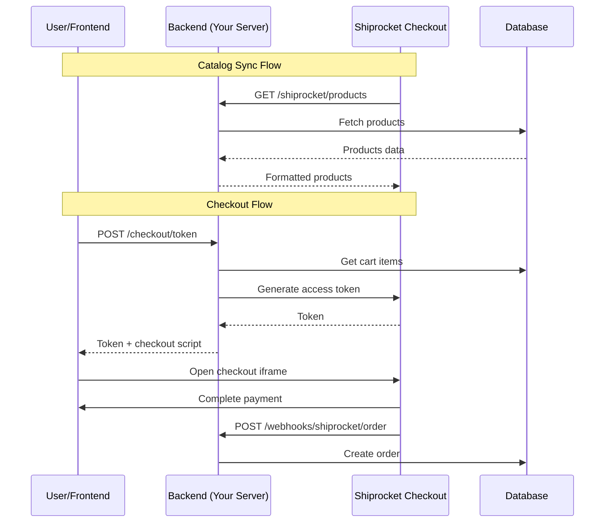

# Shiprocket Checkout - Technical Workflow

Complete technical documentation for the Shiprocket Checkout integration flow.

---

## Architecture Overview



---

## Integration Flows

### 1. Catalog Synchronization

**Purpose:** Keep Shiprocket's product catalog in sync with your database.

#### Initial Sync (Shiprocket → Your Backend)

1. Shiprocket calls `GET /api/v1/shiprocket/products?page=1&limit=100`
2. Backend fetches products from MongoDB
3. Products formatted to Shiprocket schema
4. Paginated response returned

**Files Involved:**
- `src/routes/shiprocketCatalog.route.ts`
- `src/controllers/shiprocketCatalog.controller.ts`
- `src/services/shiprocketCatalog.service.ts`

#### Real-time Updates (Your Backend → Shiprocket)

When you create/update a product:

1. Product saved to database
2. `shiprocketWebhookQueue.service.ts` queues the update
3. Queue processor sends webhook to Shiprocket
4. HMAC signature generated for authentication

**Auto-triggered on:**
- Product creation
- Product update
- Category/collection update

---

### 2. Checkout Flow

#### Step 1: Cart Preparation (Frontend)

```javascript
// Frontend: User adds items to cart
const cart = [
  { variantId: "123456789", quantity: 2 },
  { variantId: "987654321", quantity: 1 }
];
```

#### Step 2: Generate Checkout Token (Backend)

**Endpoint:** `POST /api/v1/checkout/shiprocket/token`

```typescript
// Backend Flow
1. Receive request with userId or sessionId
2. Fetch cart from database
3. Format cart for Shiprocket:
   {
     cart_data: { items: [...] },
     redirect_url: "https://your-site.com/checkout/success",
     timestamp: new Date().toISOString()
   }
4. Generate HMAC-SHA256 signature
5. Call Shiprocket API
6. Return token to frontend
```

**Files Involved:**
- `src/services/shiprocketCheckout.service.ts`
- `src/services/cart.service.ts`

#### Step 3: Render Checkout Button (Frontend)

```html
<!-- Load Shiprocket Scripts -->
<link rel="stylesheet" href="https://checkout-ui.shiprocket.com/assets/styles/shopify.css">
<script src="https://checkout-ui.shiprocket.com/assets/js/channels/shopify.js"></script>
<input type="hidden" value="your-domain.com" id="sellerDomain"/>

<!-- Checkout Button -->
<button id="shiprocket-checkout">Proceed to Checkout</button>

<script>
document.getElementById('shiprocket-checkout').addEventListener('click', async () => {
  // 1. Get token from your backend
  const response = await fetch('/api/v1/checkout/shiprocket/token', {
    method: 'POST',
    headers: { 'Content-Type': 'application/json' },
    body: JSON.stringify({ userId: currentUser.id })
  });
  const { token } = await response.json();

  // 2. Open Shiprocket Checkout iframe
  HeadlessCheckout.addToCart(event, token, {
    fallbackUrl: "https://your-site.com/checkout?product=123"
  });
});
</script>
```

#### Step 4: User Completes Checkout

1. Shiprocket iframe opens
2. User enters shipping address (auto-filled if logged in)
3. User selects payment method (UPI, Cards, COD, etc.)
4. Payment processed by Shiprocket

#### Step 5: Order Webhook (Shiprocket → Backend)

**Endpoint:** `POST /webhooks/shiprocket/order`

```typescript
// Backend Handler Flow
1. Receive raw request body
2. Verify HMAC signature (security)
3. Parse order data
4. Create order in database
5. Clear user's cart
6. Send order confirmation email
7. Return 200 OK
```

**Webhook Events:**
| Event | Action |
|-------|--------|
| `ORDER_SUCCESS` | Create order, clear cart, send email |
| `ORDER_FAILED` | Update payment status to failed |
| `ORDER_CANCELLED` | Cancel order, restore stock |
| `ORDER_STATUS_UPDATE` | Update shipment tracking |

---

### 3. Order Status Updates

Shiprocket sends status webhooks as orders progress:

```
PLACED → PROCESSING → SHIPPED → OUT_FOR_DELIVERY → DELIVERED
                   ↘ CANCELLED
                   ↘ RTO (Return to Origin)
```

**Status Mapping:**
```typescript
const statusMap = {
  PICKED_UP: 'PROCESSING',
  IN_TRANSIT: 'SHIPPED',
  OUT_FOR_DELIVERY: 'OUT_FOR_DELIVERY',
  DELIVERED: 'DELIVERED',
  RTO: 'RETURNED',
  CANCELLED: 'CANCELLED'
};
```

---

## Frontend Implementation Guide

### 1. Setup Shiprocket Scripts

Add to your HTML/React app:

```jsx
// In your checkout page component
useEffect(() => {
  // Load Shiprocket CSS
  const link = document.createElement('link');
  link.rel = 'stylesheet';
  link.href = 'https://checkout-ui.shiprocket.com/assets/styles/shopify.css';
  document.head.appendChild(link);

  // Load Shiprocket JS
  const script = document.createElement('script');
  script.src = 'https://checkout-ui.shiprocket.com/assets/js/channels/shopify.js';
  document.body.appendChild(script);

  // Set seller domain
  const input = document.createElement('input');
  input.type = 'hidden';
  input.id = 'sellerDomain';
  input.value = 'your-domain.com';
  document.body.appendChild(input);

  return () => {
    link.remove();
    script.remove();
    input.remove();
  };
}, []);
```

### 2. Checkout Button Component

```jsx
const CheckoutButton = () => {
  const [loading, setLoading] = useState(false);

  const handleCheckout = async (e) => {
    setLoading(true);
    try {
      // Get token from backend
      const res = await api.post('/checkout/shiprocket/token', {
        userId: user?.id,
        sessionId: getSessionId()
      });

      // Open Shiprocket checkout
      window.HeadlessCheckout.addToCart(e, res.data.token, {
        fallbackUrl: `${window.location.origin}/cart`
      });
    } catch (error) {
      toast.error('Failed to initiate checkout');
    } finally {
      setLoading(false);
    }
  };

  return (
    <button onClick={handleCheckout} disabled={loading}>
      {loading ? 'Processing...' : 'Checkout with Shiprocket'}
    </button>
  );
};
```

### 3. Success Page

After successful checkout, user is redirected to your `redirect_url`:

```jsx
// pages/checkout/success.tsx
const CheckoutSuccess = () => {
  const { orderId } = useSearchParams();

  useEffect(() => {
    // Clear local cart state
    dispatch(clearCart());
    
    // Fetch order details
    fetchOrderDetails(orderId);
  }, [orderId]);

  return (
    <div>
      <h1>Order Placed Successfully!</h1>
      <p>Order ID: {orderId}</p>
      <Link to="/orders">View Orders</Link>
    </div>
  );
};
```

---

## Backend File Structure

```
src/
├── services/
│   ├── shiprocketCheckout.service.ts   # Token generation
│   ├── shiprocketCatalog.service.ts    # Catalog formatting
│   ├── shiprocketWebhook.service.ts    # Webhook handlers
│   ├── shiprocketWebhookQueue.service.ts # Queue for updates
│   └── order.service.ts                # Order creation
├── controllers/
│   ├── shiprocketCatalog.controller.ts
│   └── shiprocket.webhook.controller.ts
├── routes/
│   ├── shiprocketCatalog.route.ts
│   └── webhook.routes.ts
└── utils/
    └── generateHmac.ts                 # HMAC utility
```

---

## Security Considerations

1. **HMAC Verification:** Always verify incoming webhooks
2. **IP Whitelisting:** Optional - whitelist Shiprocket IPs
3. **Raw Body Access:** Use express.raw() for webhook routes
4. **Idempotency:** Handle duplicate webhooks gracefully
5. **Error Handling:** Return 200 even on errors to prevent retries

---

## Testing Checklist

- [ ] Catalog sync APIs return correct format
- [ ] Checkout token generation works
- [ ] Checkout iframe opens correctly
- [ ] Order webhook creates order in database
- [ ] Car is cleared after successful order
- [ ] Status updates are processed correctly
- [ ] HMAC verification prevents tampering

---

## Troubleshooting

| Issue | Solution |
|-------|----------|
| Token generation fails | Check API key and secret key |
| HMAC verification fails | Ensure raw body is used, not parsed JSON |
| Products not syncing | Verify endpoint URLs shared with Shiprocket |
| Webhook not received | Check webhook URL is publicly accessible |
| Order not created | Check webhook handler logs |
